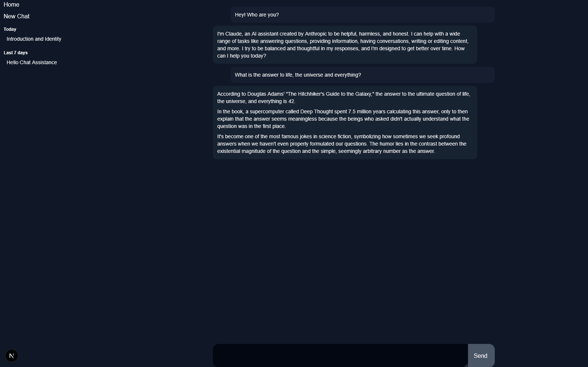

# Duckling Studio 🦆

## Overview

Duckling Studio is my playground to try some experiments with LLMs, automate stuff and
things like that as a development exercise.

## Features

As a playground, this project contains different services.

### Chat



This is a simple ChatGPT-like app to chat with different LLMs. Here you can try:

- Conversational LLM interface.
- Switch between multiple LLMs. Currently supported providers are:
    - Ollama
    - LM Studio
    - Claude AI
    - OpenAI
- Streaming messages.
- Basic chat management.
- Message edition (even those from the assistant!)

### Text classifier


This is a service to create text classifier for things like classify article's topics. Here you
have:

- Text dataset management.
- UI to tag texts in dataset.
- Zero-shot classification using LLMs.
- Simple dense neural network classifier training.

## Planned Features

- Conversation agent management (different "personalities").
- File attachments.
- Some tools (search, reasoning, uhm.... weather?).
- Whatever experiments I come up with.

## Tech Stack

This project consists of two services:

- **Web service:** For web UI and non-machine learning tasks:
    - **Next.js** - React framework for web application.
    - **PostgreSQL** - Database.
    - **Prisma ORM** - Database migration and schema definition.
- **Machine Learning Tasks service:** For machine learning tasks. Used by the web service:
    - **FastAPI** - Python Machine Learning Tasks service.
    - **PostgreSQL** - Database.
    - **SQLAlchemy & Alembic** - Database migration and schema definition.
    - **PyTorch** - Neural network training and inference.
    - **MLFlow** - Machine learning models experiments tracking.

Also, globally, this projects users:
- **Docker** - Containerization

## Project Structure

The project is organized as a monorepo to hold multiple services in the following structure:

- `/apps/web` - Next.js web service.
- `/apps/mltasks` - Machine Learning Tasks service.
- `/docker-compose.yml` - Docker compose configuration to run the application.

## Prerequisites

- Node.js >= 20
- Python 3.12
- pnpm package manager >= 9.12
- Docker
- Either:
  - Ollama installed and running on your machine.
  - LM Studio installed and running on your machine
  - Anthropic API key
  - OpenAI API key

## Getting Started

This is how to run this project locally:

1. Clone the repository
    ```bash
    git clone https://github.com/pankandev/duckling-studio.git
    cd duckling-studio
    ```
2. Set up environment variables

   Create a .env file at /apps/web/.env with the necessary API keys if available:
   ```dotenv
   ANTHROPIC_API_KEY=your_anthropic_api_key_here
   OPENAI_API_KEY=your_openai_api_key_here
   ```
   Replace `your_openai_api_key_here` or `your_anthropic_api_key_here` with your actual OpenAI API or Anthropic key.
3. Deploy de application locally:
   
    A Docker Compose configuration is provided for easy setup:
    ```bash
    docker-compose up -d
    ```
   
    In that file you can explore how the project services communication is handled.


The web application should now be running at http://localhost:3000, where you can access all of the features.

## Contributing

This project is currently a personal development exercise, but suggestions and feedback are welcome.

## License

This project is licensed under the GNU General Public License v3.0 (GPL-3.0) - see the [LICENSE](LICENSE) file for details.
