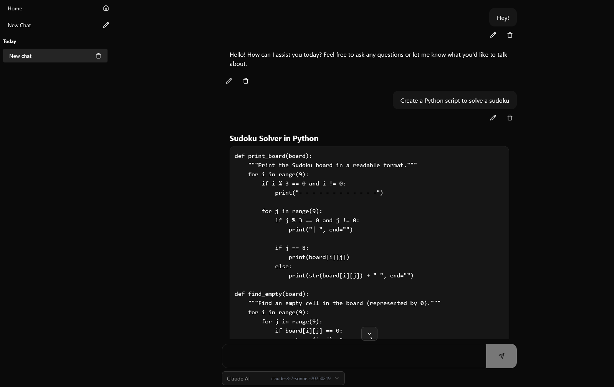

# Duckling Studio 🦆

Duckling Studio is my playground to try some experiments with LLMs, automate random stuff and
things like that.

For now, this is just a ChatGPT clone, but there are plans to add more features later.

## Overview

Currently, Duckling Studio functions as a conversational AI interface similar to ChatGPT. The application is built using
Next.js and PostgresSQL (I love PostgresSQL so much).

## Features

- Conversational AI interface with Claude.
- Streaming messages.
- Basic chat management.
- Message edition (even those from the assistant!)
- Switch between multiple LLMs. Current providers include:
  - Ollama
  - LM Studio
  - Claude AI
  - OpenAI

Here is a screenshot of the chats view:



## Planned Features

- Conversation agent management (different "personalities").
- File attachments.
- Some tools (search, reasoning, uhm.... weather?).
- Whatever experiments I come up with.

## Tech Stack

- Next.js - React framework
- PostgreSQL - Database
- Prisma ORM - Database migration and schema definition
- Docker - Containerization

## Prerequisites

- Node.js
- pnpm package manager
- Docker and Docker Compose
- Either:
  - Ollama installed and running on your machine.
  - LM Studio installed and running on your machine
  - Anthropic API key
  - OpenAI API key

## Getting Started

1. Clone the repository
    ```bash
    git clone https://github.com/pankandev/duckling-studio.git
    cd duckling-studio
    ```
2. Install dependencies
    ```bash
    pnpm install
    ```
3. Set up environment variables

   Create a .env file in the root directory with the used API keys:
   ```dotenv
   ANTHROPIC_API_KEY=your_anthropic_api_key_here
   OPENAI_API_KEY=your_openai_api_key_here
   ```
   Replace `your_openai_api_key_here` or `your_anthropic_api_key_here` with your actual Anthropic or OpenAI API key.
4. Set up the database
   The application requires a PostgresSQL database. A Docker Compose configuration is provided for easy setup:
    ```bash
    docker-compose up -d
    ```
   This will start a PostgresSQL instance as defined in the docker-compose.yml file.
5. Migrate database schema
    ```bash
    pnpm run prisma:migrate
    ```
6. Insert initial data into the database
    ```bash
    pnpm run prisma:seed
    ```
7. Run the development server
    ```bash
    pnpm run dev
    ```

The application should now be running at http://localhost:3000.

## Contributing

This project is currently a personal development exercise, but suggestions and feedback are welcome.

## License

This project is licensed under the GNU General Public License v3.0 (GPL-3.0) - see the [LICENSE](LICENSE) file for details.
